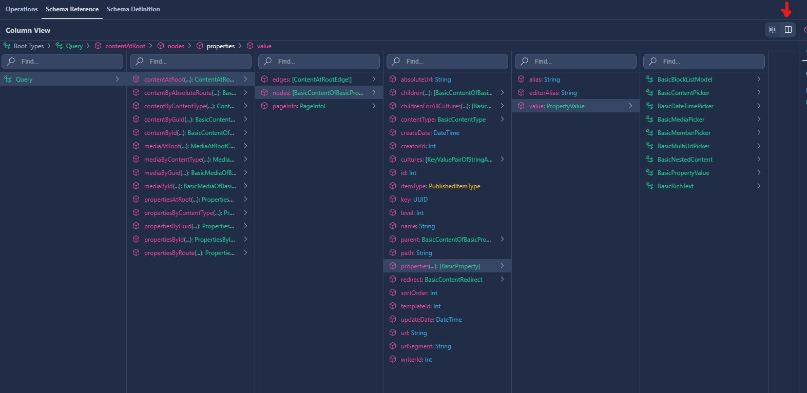

# How to query properties

From UHeadless version 3.0.0+ querying only the data you need is also available on properties. This matches the querying technique that Umbraco Heartcore has.

The GraphQL querying uses interfaces that makes it possible to have multiple models in one property.

Example "Querying a content page for blocklist content":

```graphql
{
  contentById(id: 1097) {
    properties {
      alias,
      value {
        alias
        ...on BasicBlockListModel {
        blocks {
          contentProperties {
            value {
              alias
            }
          }
        }
      }
      }
      
    }
  }
}
```

Here the `...on BasickBlockListModel` statement specifies what data we want about the blocklist. Here we've choosen the `contentProperties` value and the alias of that value.

To see other examples see Umbracos documentation here: https://our.umbraco.com/documentation/umbraco-heartcore/Tutorials/Querying-With-GraphQL/#querying-nested-content

To see which models are available on the contents properties use the `Schema Reference` at your application url (`https://localhost:3000/graphql`).

Use the button marked with the red arrow to change to the view shown here:



## To find more information see:

* [Fragments by Apollo GraphQL](https://www.apollographql.com/docs/react/data/fragments/)
* [Schemas and types by GraphQL](https://graphql.org/learn/schema/)

## Looking for more information or a way to query all properties?

See [this issue](https://github.com/nikcio/Nikcio.UHeadless/issues/75)

## Common problems

### Conflicting property names
In the case you have Conflicting property names on your properties you may need to use aliases to fetch the data you need.

Example:
```graphql
query {
  contentAtRoot(preview: true) {
    nodes {
      id
      name
      url
      properties {
        value {
          ... on BasicPropertyValue {
            value
          }
          ...on BasicBlockListModel {
            blocks {
              contentProperties {
               value {
                 alias
                 ...on BasicPropertyValue {
                   value
                 }
                 ...on BasicRichText {
                   text: value
                 }
                 ...on BasicMediaPicker {
                   mediaItems {
                     url
                   }
                 }
               } 
              }
            }
          }
        }
      }
    }
  }
}
```

Here the `BasicRichText` value property conflicts with the `BasicPropertyValue` value property so it's renamed to `text`.

For further information on aliases in GraphQL see: https://graphql.org/learn/queries/
